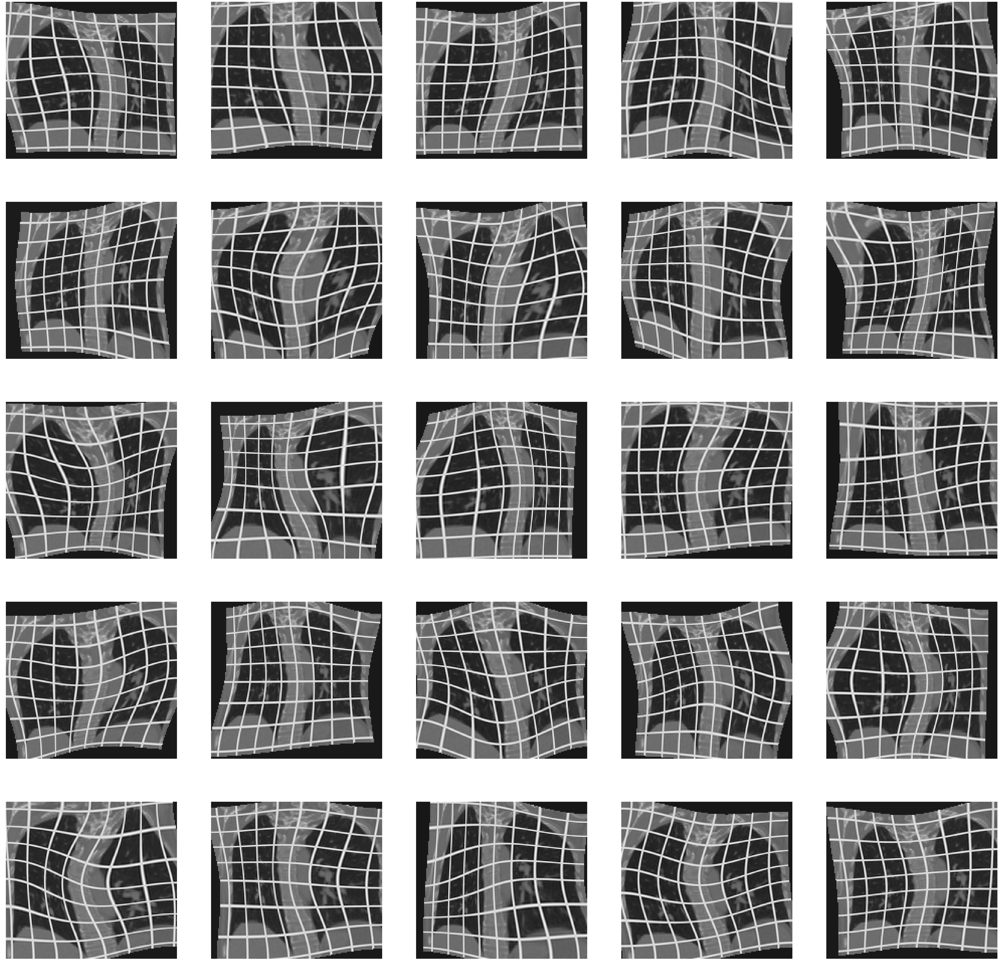

# Spatial transformations for augmentations in deep learning

This package enables you to make fast spatial transformations for the purpose of data augmentation in deep learning. The supported spatial transformations are

* `TranslationTransform`
* `LinearTransform`, supporting
    * Rigid transformations (translation + rotation)
    * Similarity transformations (translation + rotation + isotropic scaling)
    * Affine transformations (translation + rotation + arbitrary scaling + shearing)
* `BSplineTransform`: deformable transformations for image warping

which can be applied to `Interpolator` objects that wrap an image, and automatically perform B-spline interpolation.

### A minimal working example for randomly warping an image

Assuming you have an 2D image in the `image` variable:

```python
import numpy as np
import spatial_transformations as tr

# Define a random 3x3 B-spline grid for a 2D image:
random_grid = np.random.rand(2, 3, 3)
random_grid -= 0.5
random_grid /= 5

# Define a B-spline transformation object
bspline = tr.BSplineTransform(random_grid)

# Define an interpolator object for the image:
interpolator = tr.Interpolator(image)

# Transform the image using the B-spline transformation
transformed_image = interpolator.transform(bspline)
```

### Examples of our own augmentations, made using the package


